# openscad preview 

## 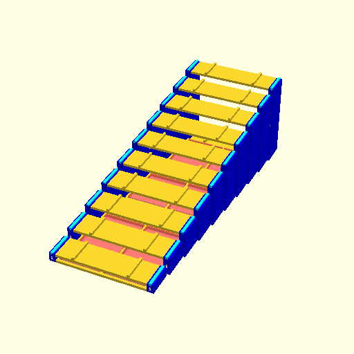 bridge
## 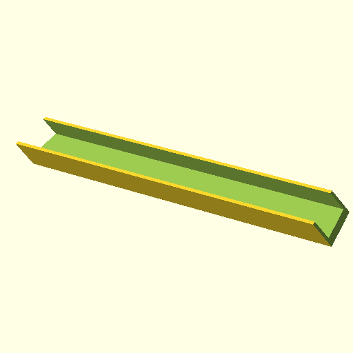 cabelcanal
## 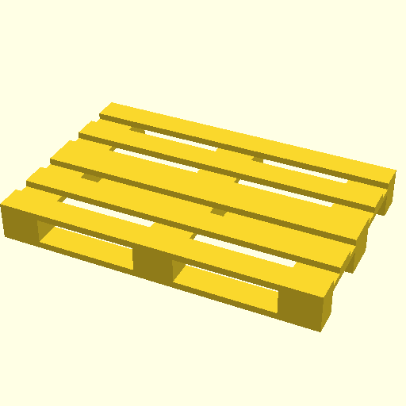 eur-pallet
## 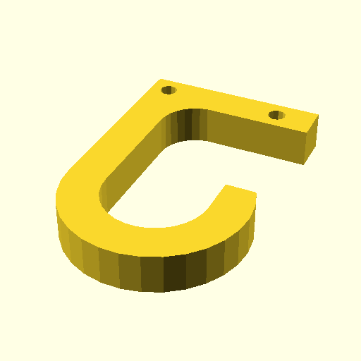 j-holder
## 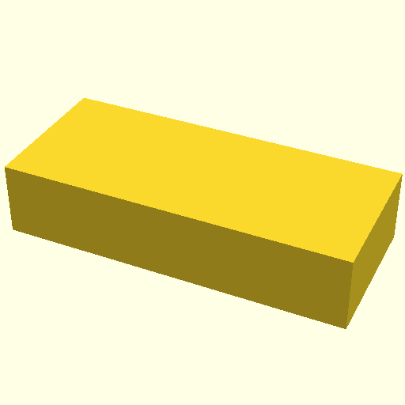 j-holder_animated
## 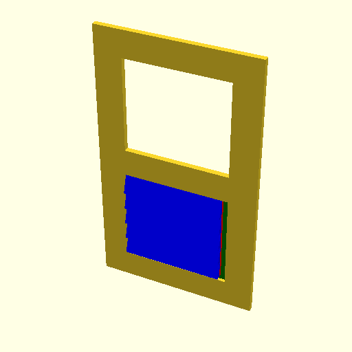 Lokschuppen
##  pen_box
## 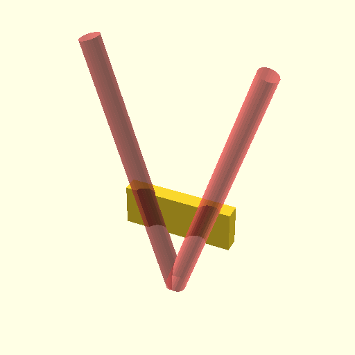 pipe_clams
##  schablone_mauer
## 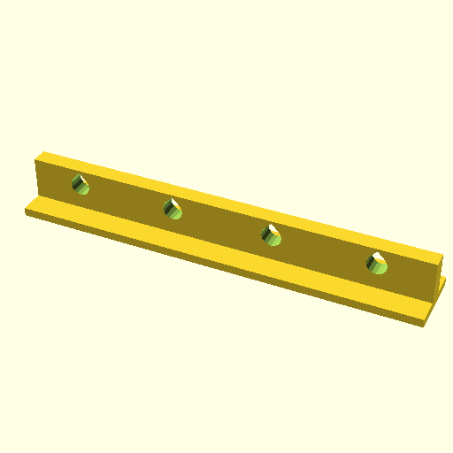 screwdriver-holder
## 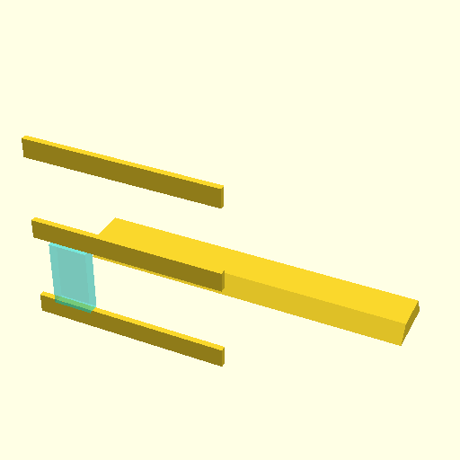 shapes
## 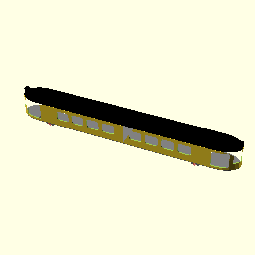 StuttgartG4
## 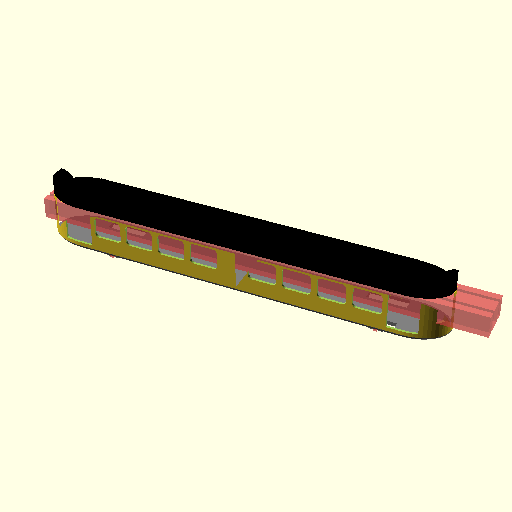 StuttgartG4_rescaled
##  switch_box
## 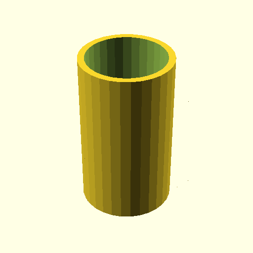 texture-roller
## 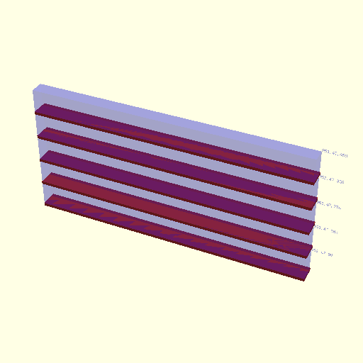 TrainDisplay
##  trainDraw
## 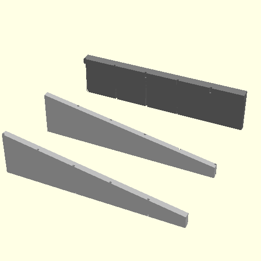 trainPlatform
## 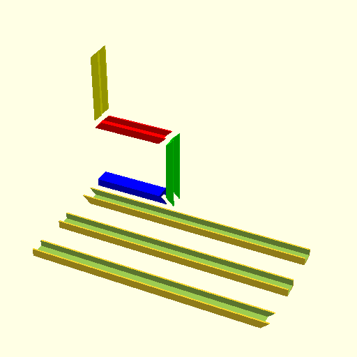 cabelcanal
## 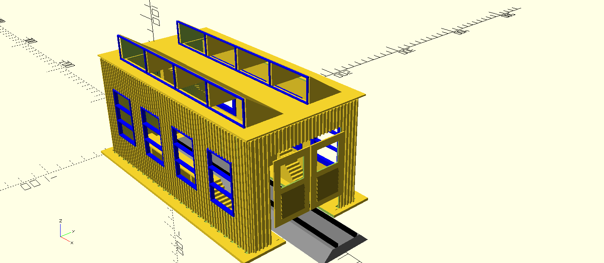 Lokschuppen

##  j-mount-design-process
