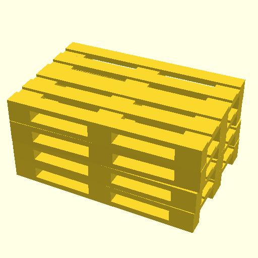

# OpenScad Projects
| Image | Filename |
| --- | --- |
|  | [.//Lokschuppen.scad](.//Lokschuppen.scad) |
|  | [.//StuttgartG4.scad](.//StuttgartG4.scad) |
|  | [.//StuttgartG4_rescaled.scad](.//StuttgartG4_rescaled.scad) |
|  | [.//TrainDisplay.scad](.//TrainDisplay.scad) |
|  | [.//adapterStaubsauber.scad](.//adapterStaubsauber.scad) |
|  | [.//barrel.scad](.//barrel.scad) |
|  | [.//booth.scad](.//booth.scad) |
|  | [.//bridge.scad](.//bridge.scad) |
|  | [.//cabelcanal.scad](.//cabelcanal.scad) |
|  | [.//cable_mount.scad](.//cable_mount.scad) |
|  | [.//cargo_wood.scad](.//cargo_wood.scad) |
|  | [.//eur-pallet.scad](.//eur-pallet.scad) |
|  | [.//hexagon_stencil.scad](.//hexagon_stencil.scad) |
|  | [.//hoh.scad](.//hoh.scad) |
|  | [.//j-holder.scad](.//j-holder.scad) |
|  | [.//j-holder_animated.scad](.//j-holder_animated.scad) |
|  | [.//pen_box.scad](.//pen_box.scad) |
|  | [.//pipe_clams.scad](.//pipe_clams.scad) |
|  | [.//planeWheel.scad](.//planeWheel.scad) |
|  | [.//rp_zero_cam.scad](.//rp_zero_cam.scad) |
|  | [.//schablone_mauer.scad](.//schablone_mauer.scad) |
|  | [.//screwdriver-holder.scad](.//screwdriver-holder.scad) |
|  | [.//shapes.scad](.//shapes.scad) |
|  | [.//switch_box.scad](.//switch_box.scad) |
|  | [.//texture-roller.scad](.//texture-roller.scad) |
|  | [.//trainDraw.scad](.//trainDraw.scad) |
|  | [.//trainPlatform.scad](.//trainPlatform.scad) |
|  | [.//tundra_drop_release.scad](.//tundra_drop_release.scad) |
|  | [.//tundra_mount.scad](.//tundra_mount.scad) |
|  | [.//tundra_mount_v2.scad](.//tundra_mount_v2.scad) |
|  | [.//usb-splitter.scad](.//usb-splitter.scad) |
|  | [.//wallmount.scad](.//wallmount.scad) |
